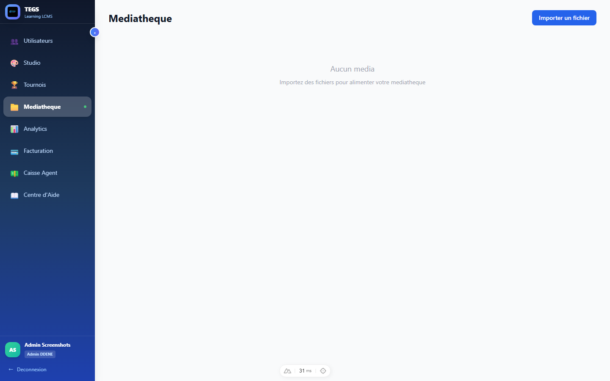
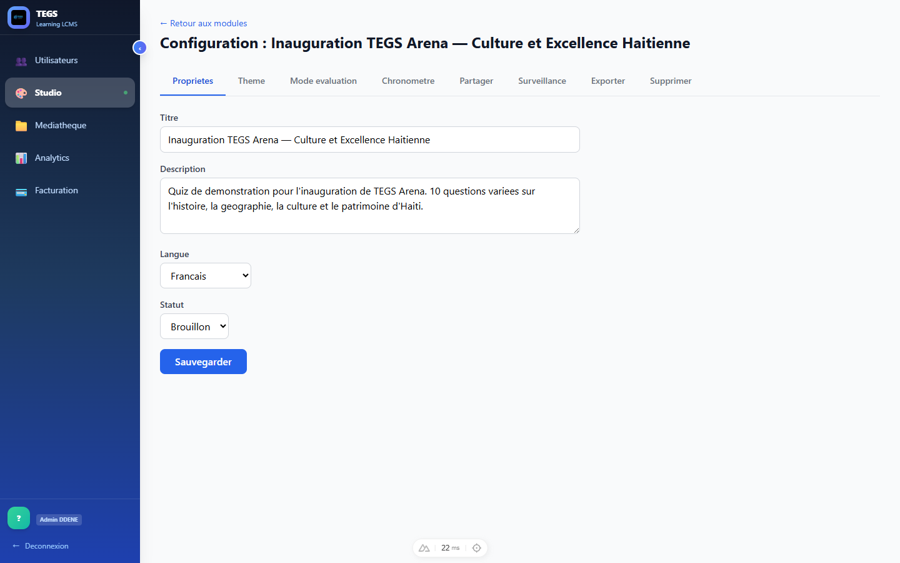
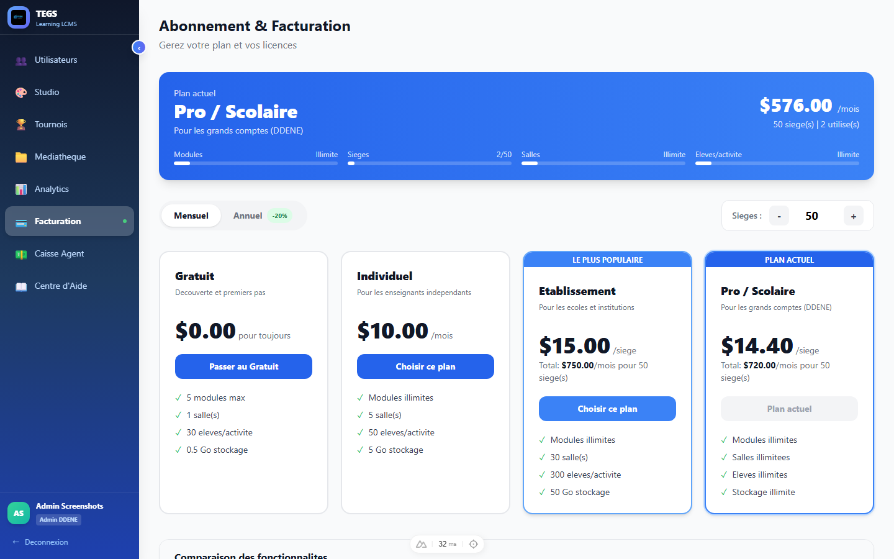

# Structure détaillée de la plateforme de formation OpenCrea Learning

## 1. Vue d’ensemble

OpenCrea Learning est une plateforme en ligne de type outil auteur (LCMS) permettant de créer des modules de formation multimédias exportables en SCORM 1.2.  
Elle s’adresse aux formateurs, concepteurs pédagogiques et créateurs de contenus qui souhaitent produire rapidement des modules e‑learning et les intégrer ensuite dans un LMS compatible SCORM.

---

## 2. Architecture fonctionnelle

L’architecture fonctionnelle de la plateforme peut être découpée en cinq grands blocs :

### 2.1 Couche auteur / édition de contenus

- Création de modules ou “documents” de formation.
- Interface d’édition web avec organisation des écrans et des sections.
- Utilisation de gabarits graphiques (templates) pour structurer les pages.
- Prévisualisation des contenus dans le navigateur.

### 2.2 Gestion des ressources pédagogiques

- Insertion de textes, images, sons, vidéos et autres médias.
- Création d’activités interactives (notamment quiz).
- Réutilisation de ressources dans plusieurs modules (logique LCMS).
- Gestion centralisée des médias (bibliothèque de ressources).

### 2.3 Moteur SCORM / exportation vers LMS

- Génération automatique de paquets SCORM 1.2 à partir des modules créés.
- Production du manifest SCORM et des fichiers associés.
- Compatibilité avec les principaux LMS supportant SCORM 1.2.
- Fonctions avancées de partage vers un LMS disponibles dans les offres payantes.

### 2.4 Couche présentation / diffusion directe

- Consultation directe des contenus dans OpenCrea Learning (lecture en ligne).
- Possibilité d’utiliser les modules comme :
  - Tutoriels interactifs,
  - CV créatifs,
  - Supports de formation,
  - Plaquettes de présentation,
  - Albums de souvenirs.

### 2.5 Services commerciaux et support

- Offre d’abonnement mensuel (formule payante à partir d’un certain montant).
- Mise à disposition d’une version gratuite, limitée sur certaines fonctionnalités.
- Support via formulaire de contact / canaux dédiés.

---

## 3. Modèle d’usage pédagogique

Plusieurs scénarios d’usage typiques sont supportés par la structure de la plateforme :

- Tutoriels pas à pas illustrés.
- CV interactifs avec navigation et médias.
- Modules de formation structurés (chapitres, sections, quiz).
- Supports visuels enrichis (plaquettes, présentations).
- Récits multimédias ou albums de souvenirs.

Chaque scénario repose sur la même logique : un module structuré en écrans, chaque écran utilisant un template et intégrant des blocs de contenu et d’interactivité.

---

## 4. Structure interne d’un module

La structure d’un module dans OpenCrea Learning peut se décrire comme suit :

### 4.1 Niveau module

- Métadonnées :
  - Titre et sous-titre,
  - Langue,
  - Description,
  - Auteur.
- Paramètres de navigation :
  - Navigation linéaire ou libre,
  - Affichage de la progression,
  - Retour arrière autorisé ou non.
- Paramètres SCORM :
  - Mode de complétion,
  - Gestion du score,
  - Règles de tentative et de suivi.

### 4.2 Niveau sections / chapitres

- Découpage du module en parties logiques (chapitres, séquences).
- Possibilité de regrouper plusieurs écrans sous une même section.
- Organisation hiérarchique (ordre des sections, prérequis éventuels).

### 4.3 Niveau écrans / pages

- Chaque écran correspond à une page affichée à l’apprenant.
- Structure définie par un template (mise en page prédéfinie).
- Zones de contenu typiques :
  - Zone de titre,
  - Zones de texte,
  - Zone d’image,
  - Zone vidéo,
  - Zone pour une activité (quiz, interaction, etc.).

### 4.4 Niveaux contenus et activités

- Contenus :
  - Texte riche (titres, listes, paragraphes),
  - Images fixes (illustrations, schémas),
  - Vidéos (démonstrations, tutoriels),
  - Audio (commentaires, narrations).
- Activités :
  - Questions à choix multiples (QCM),
  - Vrai / Faux,
  - Possibles autres types selon le moteur d’activité.
- Paramètres d’activité :
  - Score,
  - Feedback,
  - Critères de réussite.

---

## 5. Vue technique macro (SaaS auteur SCORM)

### 5.1 Front-end (interface utilisateur)

- Application web accessible via un navigateur.
- Éditeur de contenus (drag & drop ou formulaires de configuration).
- Écran de gestion des modules (listing, duplication, suppression).
- Pages publiques :
  - Page d’accueil,
  - Conditions d’utilisation,
  - Formulaire de contact,
  - Inscription / connexion.

### 5.2 Back-end (serveur et logique métier)

- Gestion des utilisateurs et des droits.
- Stockage des modules, écrans, sections et contenus.
- Génération des paquets SCORM (archive + manifest + ressources).
- Gestion des plans d'abonnement et de la facturation (côté offres payantes).

### 5.3 Stockage des données

- Base de données :
  - Utilisateurs,
  - Modules,
  - Structures de pages,
  - Activités et paramètres.
- Stockage de fichiers :
  - Images,
  - Vidéos,
  - Audios,
  - Ressources statiques.

### 5.4 Intégration avec des LMS externes

- Export des modules au format SCORM 1.2.
- Import manuel du paquet SCORM dans un LMS (Moodle, etc.).
- Pour certaines offres : mécanisme de partage / publication plus automatisé.

---

## 6. Exemple de module structuré

### 6.1 Description du module

- Titre : *Initiation à la cybersécurité*
- Public cible : débutants.
- Objectif : sensibiliser aux notions de base et aux bonnes pratiques.

### 6.2 Structure des écrans

1. **Écran 1 – Accueil**
   - Titre du module, image d’illustration, court texte d’introduction.

2. **Écran 2 – Objectifs de la formation**
   - Liste des objectifs pédagogiques.
   - Vidéo courte présentant le contenu du module.

3. **Écran 3 – Concepts clés**
   - Texte structuré en sections (mots de passe, phishing, mises à jour).
   - Schémas / infographies.

4. **Écran 4 – Cas pratiques**
   - Mise en situation avec exemples.
   - Questions intermédiaires pour impliquer l’apprenant.

5. **Écran 5 – Quiz final**
   - QCM avec plusieurs questions.
   - Score calculé et renvoyé via SCORM au LMS.

---

## 7. Idées de documentation complémentaire

Pour aller plus loin, la documentation détaillée d’OpenCrea Learning pourrait inclure :

- Un guide de prise en main pour les auteurs :
  - Création d’un premier module,
  - Utilisation des templates,
  - Ajout de médias et d’activités.
- Un guide d’intégration SCORM pour les administrateurs de LMS :
  - Export d’un module,
  - Import dans différents LMS,
  - Vérification du suivi et des scores.
- Des modèles de bonnes pratiques pédagogiques :
  - Structuration d’un module,
  - Utilisation équilibrée des médias,
  - Conception de quiz efficaces.

