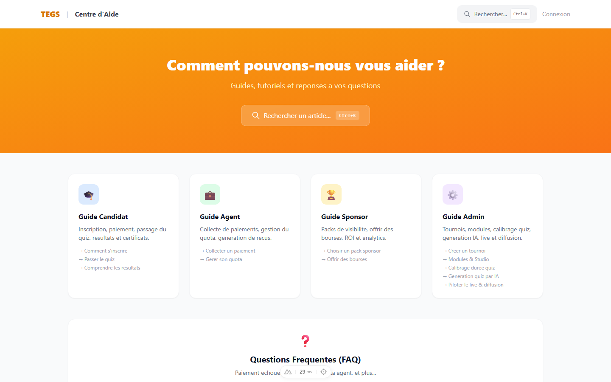
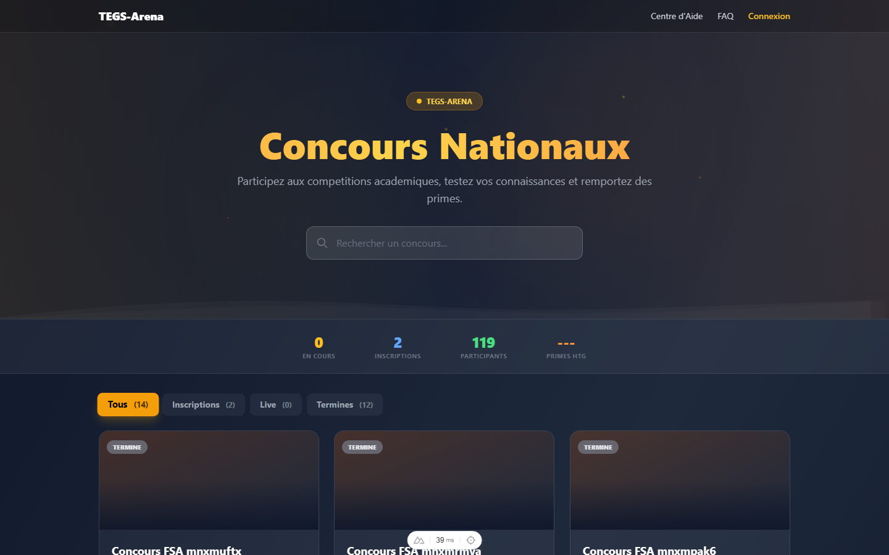
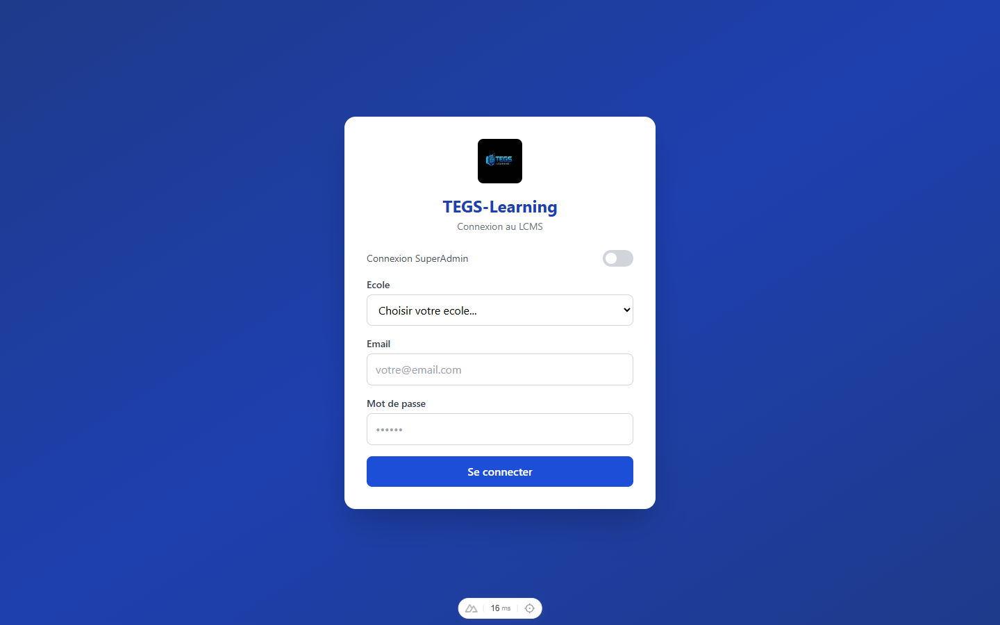

# 📸 TEGS-Arena — Guide Visuel de la Plateforme

**Version:** 3.0 — Avril 2026  
**Auteur:** edromediaTech  
**Projet:** TEGS-Learning / TEGS-Arena

> Ce document présente les captures d'écran de toutes les interfaces de la plateforme TEGS-Arena (25 écrans), plateforme nationale de compétitions éducatives pour Haïti / DDENE. Toutes les captures sont des screenshots réels de l'application.

---

## Table des matières

1. [Page de Connexion](#1--page-de-connexion)
2. [Dashboard Administrateur](#2--dashboard-administrateur)
3. [Gestion des Tournois](#3--gestion-des-tournois)
4. [Arbre de Progression (Bracket)](#4--arbre-de-progression-bracket)
5. [Éditeur de Modules (LCMS)](#5-️-éditeur-de-modules-lcms)
6. [Terminal POS Agent](#6--terminal-pos-agent)
7. [Arena TV Live (Broadcast)](#7--arena-tv-live-broadcast-obs)
8. [War Room Mobile](#8--war-room-mobile-candidat)
9. [Inscription Publique](#9--inscription-publique-au-tournoi)
10. [Analytics & Reporting](#10--analytics--reporting)
11. [Podium Final](#11--podium-final)
12. [Salle d'Attente](#12--salle-dattente-waiting-room)
13. [Gestion des Sponsors](#13--gestion-des-sponsors)
14. [Vote du Public](#14-️-vote-du-public)
15. [Scanner Superviseur](#15--scanner-superviseur)
16. [Reporting & Résultats](#16-reporting--résultats)
17. [Live Classroom](#17-live-classroom-surveillance)
18. [Abonnement & Facturation](#18-abonnement--facturation)
19. [Médiathèque](#19-médiathèque)
20. [Configuration du Module](#20-configuration-du-module)
21. [Gestion des Utilisateurs](#21-gestion-des-utilisateurs)
22. [Gestion des Organisations](#22-gestion-des-organisations)
23. [Centre d'Aide](#23-centre-daide)
24. [Lobby Arena](#24-lobby-arena-accueil)
25. [Studio IA](#25-studio-ia-génération-de-quiz)

---

## 1. 🔐 Page de Connexion

Interface d'authentification avec support multi-rôles (superadmin, admin_ddene, teacher, authorized_agent, student).


**Chemin :** `/login`  
**Fonctionnalités :**
- Connexion par email/mot de passe (JWT 24h)
- Création de compte avec sélection d'école (tenant)
- Redirection selon le rôle après connexion

---

## 2. 📊 Dashboard Administrateur

Tableau de bord principal avec les KPIs en temps réel.


**Chemin :** `/admin` (layout admin)  
**Métriques affichées :**
- Tournois actifs, participants, revenus, agents
- Graphiques d'inscriptions et répartition des paiements
- Navigation latérale vers tous les modules

---

## 3. 🏆 Gestion des Tournois

Interface CRUD pour créer et gérer les compétitions éducatives.


**Chemin :** `/admin/tournaments`  
**Fonctionnalités :**
- Création de tournoi (titre, frais, rounds, modules, prix)
- Statuts : `DRAFT` → `REGISTRATION` → `ACTIVE` → `COMPLETED`
- Partage via lien public (shareToken)
- Configuration des rounds éliminatoires

---

## 4. 🌳 Arbre de Progression (Bracket)

Visualisation en temps réel de la progression du tournoi éliminatoire.


**Chemin :** `/admin/tournaments/[id]` → Bracket  
**Fonctionnalités :**
- 3 rounds : Éliminatoires → Demi-finales → Finale
- Promotion automatique (`promoteTopX`)
- Départage par score DESC + temps ASC
- Mise à jour en temps réel via Socket.io

---

## 5. ✏️ Éditeur de Modules (LCMS)

Outil auteur pour créer des modules de formation multimédias.


**Chemin :** `/admin/modules/[id]`  
**Blocs disponibles :**
- Texte riche, Images, Vidéos, Audio
- Quiz (QCM, Vrai/Faux)
- Prévisualisation et export SCORM/cmi5

---

## 6. 💰 Terminal POS Agent

Interface de collecte en espèces pour les agents autorisés.


**Chemin :** `/agent/collection`  
**Fonctionnalités :**
- Recherche de participant par nom/email
- 4 vérifications avant encaissement :
  1. Agent vérifié (`isAgentVerified`)
  2. Contrat signé (`contractAcceptedAt`)
  3. Compte non bloqué (`isBlocked`)
  4. Quota disponible (`guaranteeBalance - usedQuota ≥ fee`)
- Affichage du portefeuille (caution, quota utilisé, disponible)
- Commission automatique (taux configurable)
- Génération de bordereau PDF

---

## 7. 📺 Arena TV Live (Broadcast OBS)

Overlay de diffusion en direct pour Facebook/YouTube via OBS Studio.


**Chemin :** `/live-tournament/[token]/broadcast`  
**Configuration :**
- Résolution Full HD 1920×1080 @ 60fps
- Plaque commentateur (via `?commentator=Nom`)
- Ticker sponsors défilant (30s infinite)
- Breaking news overlay
- Podium reveal animé
- Raccourcis clavier : `I` = Guide OBS, `P` = Toggle podium

**Configuration OBS Studio :**
```
1. Source > Navigateur (Browser)
2. URL : https://domain.com/live-tournament/TOKEN/broadcast?commentator=Nom
3. Résolution : 1920 × 1080
4. FPS : 60
```

---

## 8. 📱 War Room Mobile (Candidat)

Interface d'examen en mode lockdown pour les candidats.


**Chemin :** `/mobile/warroom/[id]`  
**Flux :** `Lobby (attente) → Countdown (10s) → Lockdown (fullscreen) → Results`  
**Sécurité :**
- Fullscreen forcé, bouton retour bloqué
- Caméra de surveillance (proctoring)
- Détection perte de focus (blur)
- Soumission automatique si max_blur dépassé

---

## 9. 📝 Inscription Publique au Tournoi

Page d'inscription accessible sans compte, via lien partageable.


**Chemin :** `/tournament/[shareToken]`  
**3 canaux de paiement :**

| Canal | Provider | Méthode |
|-------|----------|---------|
| **MonCash** | Digicel Haiti | OAuth2 → redirect → webhook |
| **Natcash** | Natcom Haiti | API Key → redirect → callback |
| **Agent Cash** | Réseau POS | Agent encaisse → QR ticket |

**Bonus :** Code Bourse (`BOURSE-XXXXXXXX`) pour inscription gratuite sponsorisée.

---

## 10. 📈 Analytics & Reporting

Dashboard d'analyse avec KPIs et exportation de rapports.


**Chemin :** `/admin/analytics`  
**Métriques :**
- Taux de réussite, score moyen, temps moyen
- Répartition par district et établissement
- Distribution des méthodes de paiement
- Export PDF et Excel
- Commentaire IA et plan de remédiation

---

## 11. 🥇 Podium Final

Révélation animée du classement final avec podium et prix.


**Chemin :** `/live-tournament/[token]` → Podium  
**Éléments :**
- 🥇 Champion (1ère place + prime)
- 🥈 Vice-Champion (2ème place)
- 🥉 3ème Place
- ❤️ "Coup de Cœur du Public" (votes populaires)
- Logos sponsors visibles selon leur tier
- Certificat PDF téléchargeable

---

## 12. ⏳ Salle d'Attente (Waiting Room)

Système de file d'attente pour gérer les pics de trafic.


**Chemin :** `/tournament/waiting-room`  
**Paramètres :**
- `maxConcurrent` : 2000 (seuil avant activation)
- `batchSize` : 50 (personnes libérées par cycle)
- `intervalSeconds` : 30 (fréquence de libération)
- Priorité `HIGH` pour les candidats avec `competitionToken`
- Redirection automatique au "feu vert"

---

## 13. 🤝 Gestion des Sponsors

Administration des partenaires et suivi du ROI social.


**Chemin :** `/admin/tournaments/[id]` → Sponsors  

**Tiers de visibilité :**

| Tier | Ticket | Certificat | Arena | Mobile | Ticker |
|------|--------|------------|-------|--------|--------|
| 💎 Diamond | ✅ | ✅ | ✅ | ✅ | ✅ |
| 🥇 Gold | ✅ | ✅ | ✅ | ❌ | ✅ |
| 🥈 Silver | ✅ | ❌ | ✅ | ❌ | ❌ |
| 🥉 Bronze | ✅ | ❌ | ❌ | ❌ | ❌ |

**Parrainage de masse :** SponsorshipPack avec code `BOURSE-XXXXXXXX` pour inscription gratuite.

---

## 14. ❤️ Vote du Public

Page de vote accessible à tous, sans inscription requise.


**Chemin :** `/tournament/[token]/vote`  
**Fonctionnalités :**
- 1 vote par IP par heure (rate limiting)
- Partage Facebook + WhatsApp (message pré-rempli)
- Cœur animé en temps réel sur le broadcast
- Double podium : **Major de Promotion** (score) + **Coup de Cœur** (votes)

---

## 15. 🔍 Scanner Superviseur

Interface mobile pour scanner et vérifier les badges QR des participants.


**Chemin :** `/mobile/supervisor`  
**Fonctionnalités :**
- Scanner QR continu (`html5-qrcode`)
- Vérification instantanée du badge (vibration OK/erreur via Capacitor Haptics)
- Historique des scans avec horodatage
- Alertes fraude en temps réel

---

## 16. Reporting & Résultats

Tableau de bord de résultats avec export Excel et commentaires IA.


**Chemin :** `/admin/modules/[id]/reporting`  
**Fonctionnalités :**
- KPIs : participants, score moyen, taux de réussite
- Tableau des résultats par élève (score, %, statut)
- Export Excel et commentaires IA (remédiation)
- Durée totale du module configurable

---

## 17. Live Classroom (Surveillance)

Interface de surveillance en temps réel des participants connectés.


**Chemin :** `/admin/modules/[id]/live`  
**Fonctionnalités :**
- Monitoring : connectés, soumis, déconnectés, éliminés
- Score moyen en temps réel
- Onglet Proctoring (caméra de surveillance)
- Alertes de perte de focus

---

## 18. Abonnement & Facturation

Page de gestion des plans d'abonnement et licences.


**Chemin :** `/admin/billing`  
**Plans disponibles :**
- Gratuit (5 modules, 1 salle, 30 élèves)
- Individuel ($10/mois, modules illimités)
- Établissement ($15/siège, 30 salles)
- Pro / Scolaire ($14.40/siège, illimité)

---

## 19. Médiathèque

Gestionnaire de fichiers médias avec stockage cloud GCS.


**Chemin :** `/admin/media`  
**Fonctionnalités :**
- Import de fichiers (images, vidéos, audio, PDF)
- Stockage Google Cloud Storage
- URLs signées sécurisées
- Isolation par tenant

---

## 20. Configuration du Module

Page de paramétrage avancé d'un module de formation.


**Chemin :** `/admin/modules/[id]/settings`  
**Onglets :**
- Propriétés (titre, description, langue, statut)
- Thème visuel
- Mode évaluation
- Chronomètre global
- Partage (lien public)
- Surveillance (proctoring)
- Exporter (SCORM/cmi5)
- Supprimer

---

## 21. Gestion des Utilisateurs

Administration des comptes utilisateurs par rôle.


**Chemin :** `/admin/users`  
**Fonctionnalités :**
- CRUD utilisateurs avec filtre par rôle
- Assignation de rôles (admin, teacher, student, agent)
- Activation / désactivation de comptes
- Isolation par tenant

---

## 22. Gestion des Organisations

Administration multi-tenant des écoles et organisations.


**Chemin :** `/admin/tenants`  
**Fonctionnalités :**
- Vue globale : total organisations, actives, utilisateurs
- CRUD organisations avec code unique
- Email de contact par organisation
- Activation / désactivation

---

## 23. Centre d'Aide

Hub de documentation interactive avec guides par rôle.



**Chemin :** `/docs`  
**Sections :**
- Guide Candidat (inscription, quiz, résultats, badge)
- Guide Agent (collecte, quota)
- Guide Sponsor (packs, bourses)
- Guide Admin (tournois, modules, calibrage, IA, live)
- FAQ interactive

---

## 24. Lobby Arena (Accueil)

Page d'accueil publique avec grille des concours nationaux.



**Chemin :** `/`  
**Fonctionnalités :**
- Compteurs animés (concours, inscriptions, primes)
- Onglets : Inscriptions, Live, Terminés
- Recherche de concours
- Liens vers Centre d'Aide et Connexion

---

## 25. Studio IA (Génération de Quiz)

Éditeur de blocs avec génération de questions par intelligence artificielle.



**Chemin :** `/admin/modules/[id]/screens/[screenId]`  
**Fonctionnalités :**
- Palette de blocs (contenu + questions)
- Génération automatique de quiz par IA
- 18 types de blocs disponibles
- Prévisualisation en temps réel

---

## Architecture des rôles et accès aux interfaces

```
┌─────────────────────────────────────────────────────────┐
│                    TEGS-Arena                           │
├─────────────┬───────────────────────────────────────────┤
│ SuperAdmin  │ Tout accès + CRUD Tenants                 │
│ Admin DDENE │ Dashboard, Tournois, Agents, Analytics    │
│ Teacher     │ Modules, Examens, Reporting               │
│ Agent       │ Terminal POS, Portefeuille, Bordereau     │
│ Student     │ War Room, Inscription, Résultats          │
│ Spectateur  │ Arena TV, Vote, Inscription publique      │
│ Superviseur │ Scanner QR, Vérification badges           │
└─────────────┴───────────────────────────────────────────┘
```

---

**Document généré le 15 avril 2026**  
**TEGS-Learning v2.0 — edromediaTech / DDENE Haïti**
