# TEGS-Arena — Document Technique Complet
## Plateforme Nationale de Competitions Educatives — Haiti / DDENE

**Version:** 2.0 — Avril 2026
**Auteur:** Ronel Similien / edromediaTech
**Projet GCP:** luminous-mesh-459718-p4

---

# I. Vision et Introduction

## 1.1. Presentation du projet TEGS-Arena

TEGS-Arena est une extension de la plateforme TEGS-Learning (LCMS/LMS multi-tenant) qui transforme l'evaluation educative en spectacle national interactif. Le systeme permet d'organiser des tournois eliminatoires a grande echelle, avec paiement en especes via un reseau d'agents autorises, diffusion en direct sur Facebook/YouTube, et vote du public en temps reel.

La plateforme a ete construite en 10 sprints (Auth, xAPI, Modules, Block Builder, cmi5, Runtime, Cloud Storage, Deploy, Mobile Bridge, Analytics) puis etendue avec les modules Tournament, Payment, Mobile Terminal, Sponsoring, Broadcasting et Social Engagement.

## 1.2. Objectifs strategiques

| Axe | Objectif | Indicateur |
|-----|---------|------------|
| **Education** | Democratiser l'acces aux competitions academiques dans tous les districts | Taux de participation par district |
| **Meritocratie** | Garantir l'equite par departage transparent (score + temps de reponse) | Indice de fiabilite proctoring |
| **Finance** | Modele hybride auto-finance (inscriptions B2C + sponsoring B2B + caution agents) | Revenu net par tournoi |
| **Inclusion** | Paiement cash via agents locaux pour les zones sans mobile money | Ratio cash/mobile money |
| **Spectacle** | Transformer les concours en evenements TV nationaux | Audience Facebook/YouTube |

## 1.3. Publics cibles

| Acteur | Role | Interface |
|--------|------|-----------|
| **Candidat** | Passe les epreuves, suit sa progression | Mobile (War Room), Web (/share) |
| **Agent Autorise** | Encaisse les inscriptions cash, genere les tickets | Terminal POS (/agent/collection) |
| **Sponsor** | Finance les concours, parraine des candidats | Admin dashboard, Visibilite multicanale |
| **Superviseur** | Scanne les badges, surveille la fraude | Mobile (/mobile/supervisor) |
| **Spectateur** | Regarde le live, vote pour ses favoris | Live Arena TV, Page vote |
| **Admin DDENE** | Gere les tournois, les agents, les finances | Admin dashboard complet |
| **SuperAdmin** | Configuration globale, bypass toutes contraintes | Acces total |

### Apercu de la page de connexion

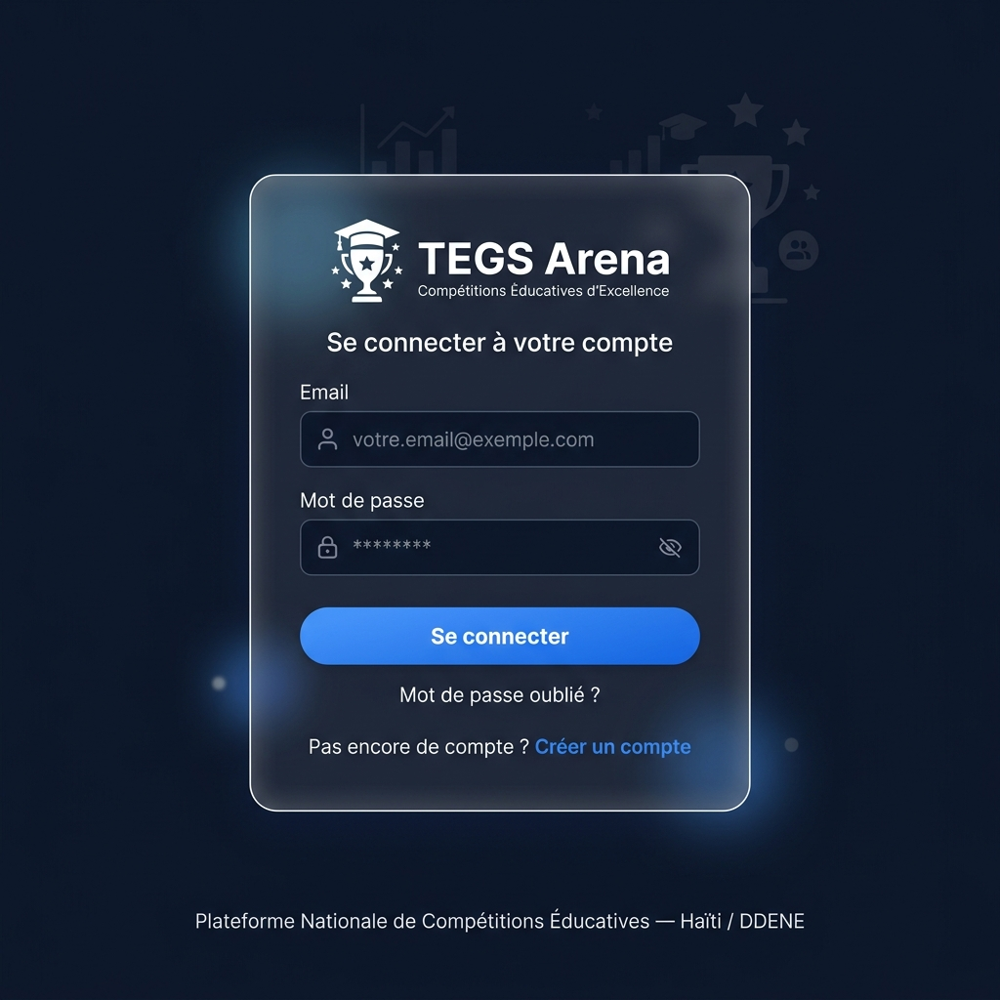

---

# II. Architecture Technique (The Stack)

## 2.1. Infrastructure Cloud

```
                    ┌─────────────────────────────┐
                    │     Firebase Hosting          │
                    │  luminous-mesh-459718-p4      │
                    │  .web.app / .firebaseapp.com  │
                    │  (Nuxt 3 SPA + Tailwind)      │
                    └──────────┬──────────────────┘
                               │ HTTPS
                    ┌──────────▼──────────────────┐
                    │     Google Cloud Run          │
                    │  tegs-backend                 │
                    │  1Gi RAM / 2 CPU              │
                    │  Min 1 — Max 10 instances     │
                    │  Concurrency: 80              │
                    │  Port: 3000                   │
                    └──┬────────┬──────────┬──────┘
                       │        │          │
              ┌────────▼┐  ┌───▼────┐  ┌──▼───────────┐
              │ MongoDB  │  │  GCS   │  │ GCP Secret   │
              │ Atlas    │  │Storage │  │ Manager (7)   │
              │ (mLab)   │  │Service │  │ JWT, Mongo,   │
              └──────────┘  └────────┘  │ MonCash, etc. │
                                        └──────────────┘
```

| Service | Configuration |
|---------|--------------|
| **Cloud Run** | node:20-alpine, non-root user `tegs`, health check /api/health |
| **Firebase Hosting** | SPA rewrite, cache 7d JS/CSS, 30d images, security headers |
| **MongoDB** | Connection via URI dans Secret Manager |
| **GCS** | dp-storage-service pour media uploads, signed URLs |
| **Secret Manager** | 7 secrets: mongo-uri, jwt-secret, gcs-jwt-secret, moncash-client-id, moncash-client-secret, natcash-merchant-id, natcash-api-key |

## 2.2. Backend & Temps Reel

**Stack:** Node.js 20 + Express 4 + Mongoose 8 + Socket.io 4

**Architecture:**
```
server.js
├── 3 middlewares globaux (compression, CORS restrictif, JSON 5MB)
├── 20 fichiers de routes montees sur /api/*
├── 5 services (cmi5Xml, moncash, natcash, fcm, trafficController)
├── 4 namespaces Socket.io (/prof, /student, /spectator, /tournament)
└── Health check: GET /api/health
```

**CORS restrictif (production):**
```
Origins autorisees:
- http://localhost:3002
- http://127.0.0.1:3002
- process.env.FRONTEND_URL
- https://luminous-mesh-459718-p4.web.app
- https://luminous-mesh-459718-p4.firebaseapp.com
```

## 2.3. Frontend & Mobile

### Apercu du Dashboard Administrateur

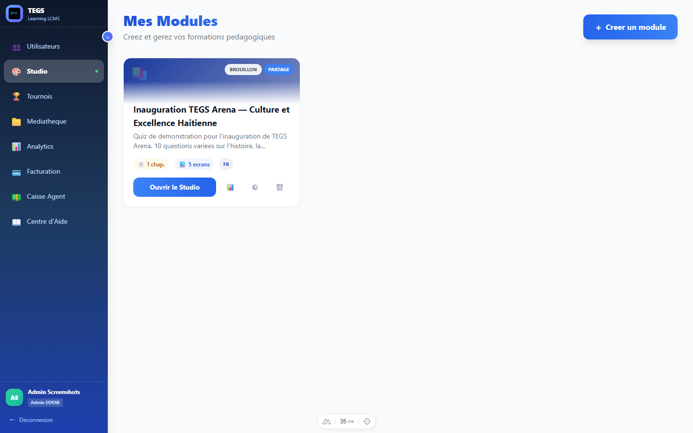

**Stack:** Nuxt 3.15 (SSR off/SPA) + Pinia + Tailwind CSS + Socket.io-client + Chart.js

| Composant | Nombre |
|-----------|--------|
| Pages | 22 |
| Composants blocs | 44 (Edit + Preview) |
| Composants share | 8 (reponses interactives) |
| Composants tournament | 2 (TournamentTree, SponsorCarousel) |
| Stores Pinia | 3 (auth, modules, tournaments) |
| Composables | 5 (useApi, useLiveSocket, useSpectatorSocket, useTournamentSocket, useNativeBridge) |
| Layouts | 2 (admin, default) |

**Mobile (Capacitor):**
```
App ID: com.tegs.arena
Plugins: core, cli, android, app, camera, push-notifications,
         haptics, status-bar, splash-screen, browser
+ html5-qrcode (scanner QR)
```

## 2.4. Securite & Secrets

| Couche | Mecanisme |
|--------|-----------|
| **Authentification** | JWT (jsonwebtoken), expiration 24h, cookie `__session` |
| **Autorisation** | 5 roles: superadmin > admin_ddene > teacher > authorized_agent > student |
| **Multi-tenant** | req.tenantFilter() sur CHAQUE requete MongoDB |
| **XSS** | Sanitisation des contenus dans modules.js |
| **CORS** | Restrictif (domaines Firebase + localhost) |
| **Secrets** | GCP Secret Manager (jamais en clair dans le code) |
| **Docker** | Non-root user, multi-stage build |
| **Agent POS** | 4 checks sequentiels: verifie → contrat → bloque → quota |
| **Rate Limit** | Vote: 1/heure/IP |
| **Waiting Room** | Sas virtuel configurable (seuil 2000) |

---

# III. Modules Fonctionnels (Core Features)

## 3.1. Moteur de Tournoi

### Apercu de la gestion des tournois

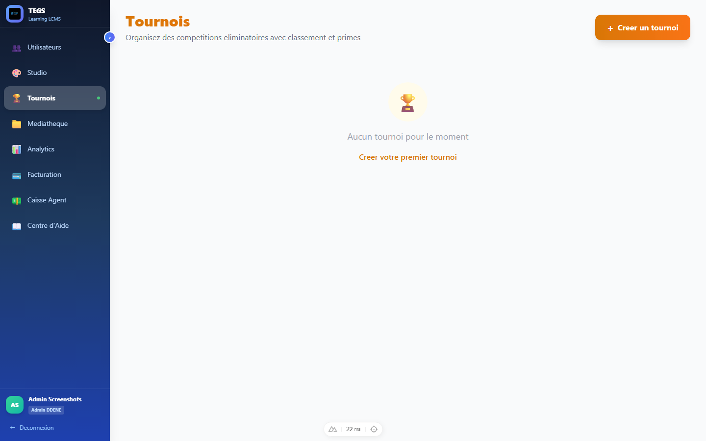

### Pipeline eliminatoire

```
DRAFT → REGISTRATION → ACTIVE → COMPLETED
                         │
                    Round 1 (Eliminatoires)
                    │  promoteTopX = 50
                    │  Tri: score DESC, temps ASC
                    │  50 qualifies, reste elimine
                    ▼
                    Round 2 (Demi-finales)
                    │  promoteTopX = 10
                    ▼
                    Round 3 (Finale)
                    │  promoteTopX = 1
                    ▼
                    PODIUM
                    1er: Champion (Prime)
                    2e: Vice-Champion
                    3e: 3e Place
```

### Departage

A score egal, le systeme utilise le **temps de reponse** (plus rapide gagne). La duree est parsee depuis le format ISO 8601 (ex: `PT2M30S` → 150 secondes).

```javascript
scored.sort((a, b) => b.percentage - a.percentage || a.durationSec - b.durationSec);
```

### Modele Tournament

```
Tournament {
  title, description, coverImage
  status: draft | registration | active | completed | cancelled
  registrationFee: Number (HTG)
  maxParticipants: Number (0 = illimite)
  rounds: [{
    order, label, module_id, section_index, promoteTopX, status, startTime, endTime
  }]
  prizes: [{ rank, label, amount, currency }]
  currentRound: Number
  shareToken: String (acces public)
  tenant_id, created_by
}
```

### Apercu de l'arbre de progression (Bracket)

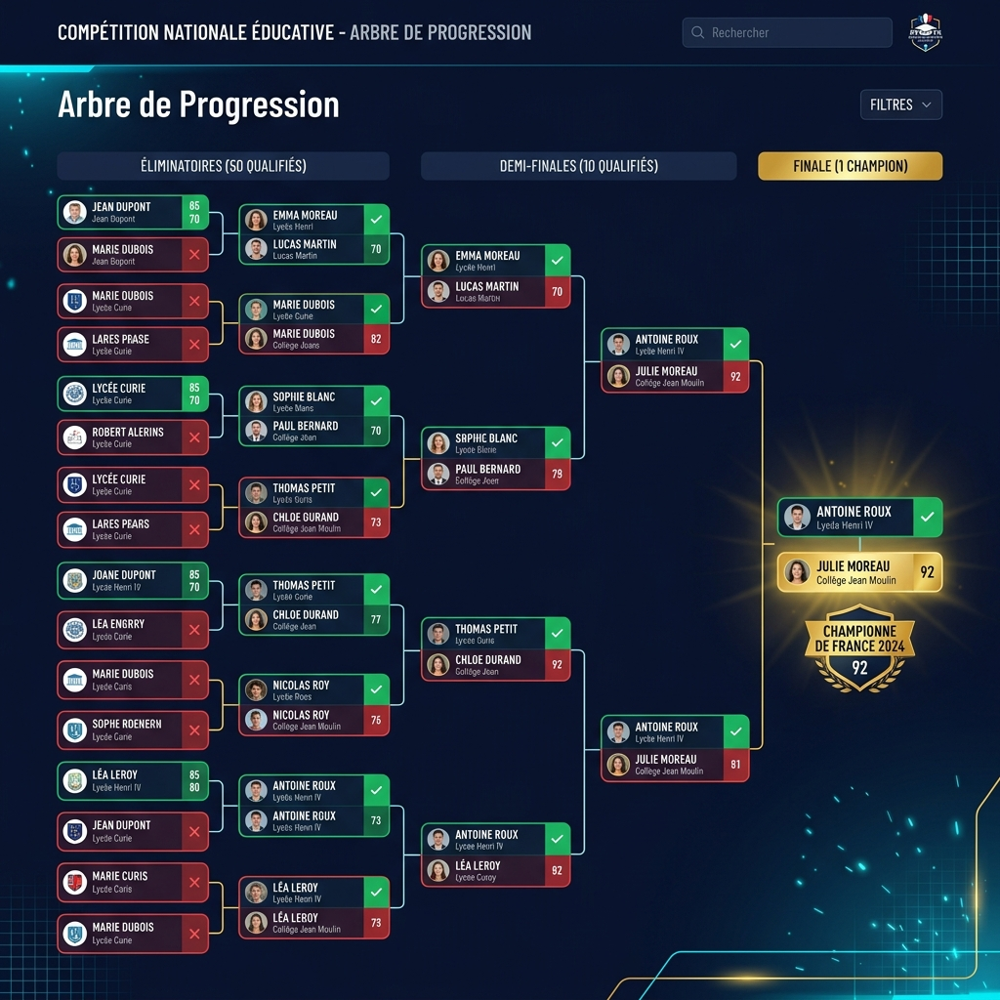

### Endpoints tournoi

| Route | Methode | Description |
|-------|---------|-------------|
| `/tournaments` | POST | Creer tournoi |
| `/tournaments` | GET | Lister (tenant) |
| `/tournaments/:id` | GET | Detail + participants |
| `/tournaments/:id` | PUT | Modifier |
| `/tournaments/:id` | DELETE | Supprimer (draft only) |
| `/tournaments/:id/register` | POST | Inscrire (auth) |
| `/tournaments/:id/participants` | GET | Lister participants |
| `/tournaments/:id/start-round` | POST | Demarrer round |
| `/tournaments/:id/advance` | POST | Promotion promoteTopX |
| `/tournaments/:id/bracket` | GET | Arbre progression |
| `/tournaments/:id/podium` | GET | Classement final |
| `/tournaments/:id/certificate/:pid` | GET | Certificat PDF |
| `/tournaments/public/:shareToken` | GET | Infos publiques |
| `/tournaments/public/:shareToken/register` | POST | Inscription publique + QR |
| `/tournaments/verify-token/:token` | GET | Verifier badge |

---

## 3.2. Fintech & POS (Paiement Multi-Canal)

### Apercu du Terminal POS Agent

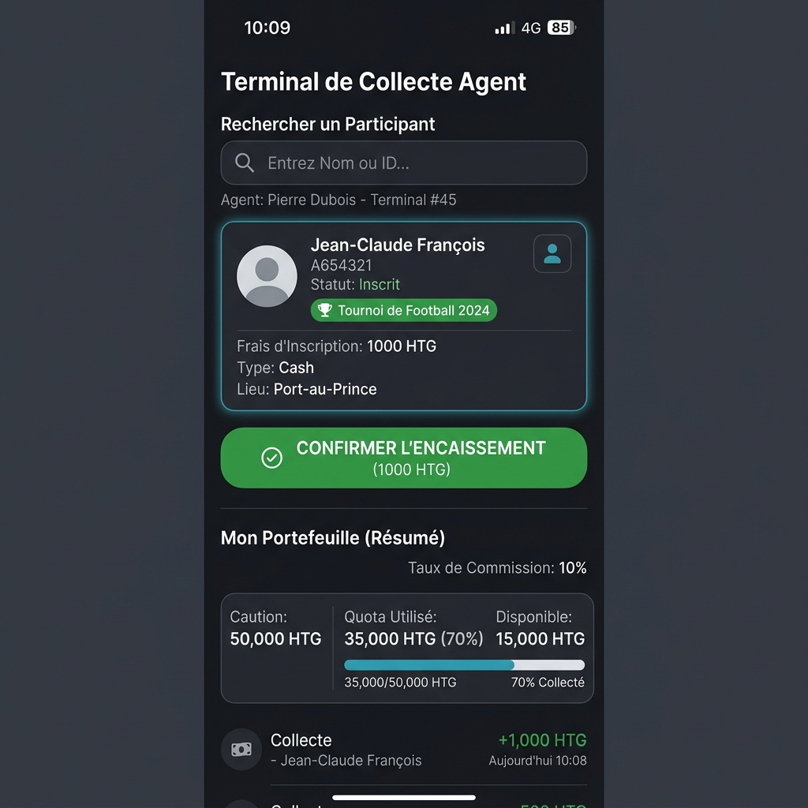

### Apercu de l'inscription publique

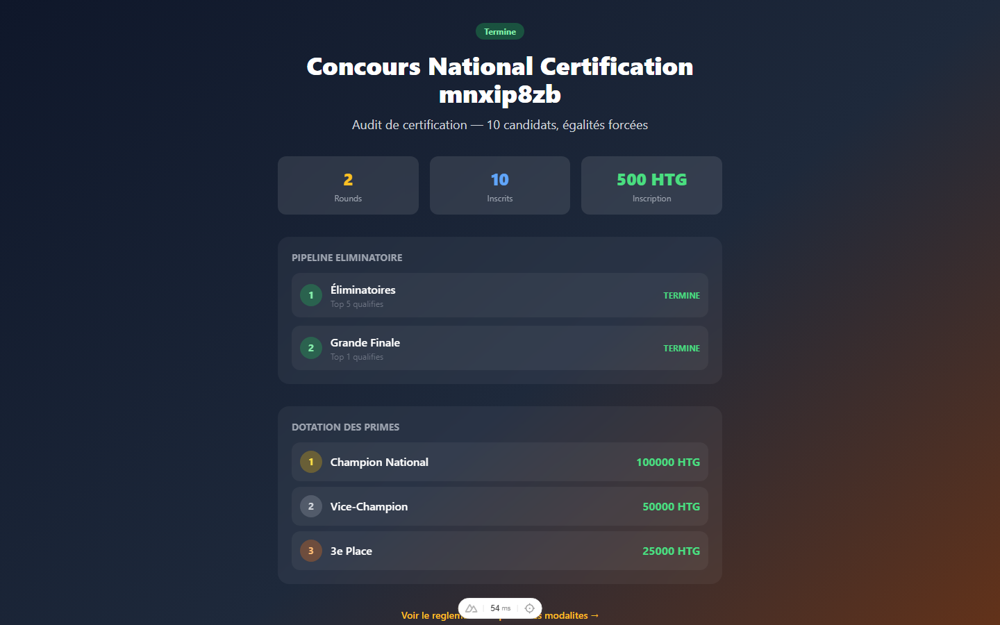

### 3 canaux de paiement

| Canal | Provider | Flow |
|-------|----------|------|
| **MonCash** | Digicel Haiti | OAuth2 → createPayment → redirect → webhook → verify |
| **Natcash** | Natcom Haiti | API Key → initiate → redirect → callback → verify |
| **Agent Cash** | Reseau POS | Agent encaisse → Transaction → QR ticket |

### Systeme Agent Autorise

**Onboarding agent:**
```
1. Admin cree un compte role: authorized_agent
2. Admin verifie l'agent (isAgentVerified = true)
3. Agent accepte le contrat numerique (6 articles)
4. Admin configure: caution, commission, limite
5. Agent peut encaisser
```

**4 checks avant chaque encaissement:**
```
CHECK 0:  isAgentVerified? → "Pas encore verifie"
CHECK 0b: contractAcceptedAt? → "Contrat non accepte"
CHECK 1:  isBlocked? → "Compte suspendu" (bypass superadmin)
CHECK 2:  currentPaymentCount < maxPaymentLimit? → "Limite atteinte" (bypass superadmin)
CHECK 3:  guaranteeBalance - usedQuota >= fee? → "Quota insuffisant" (bypass superadmin)
```

**Commission automatique:**
```
fee = 1000 HTG, commissionRate = 10%
commissionAmount = 1000 × (10/100) = 100 HTG
netAmount = 1000 - 100 = 900 HTG (dette envers DDENE)
```

**Boucle financiere:**
```
Agent encaisse 10 × 500 HTG = 5000 HTG
  → usedQuota = 5000, available = 0
  → BLOQUE (quota epuise)

Agent verse 4000 HTG a la DDENE
  → POST /agent/settle-debt → amountSettled: 4000
  → usedQuota = 1000, available = 4000
  → AUTO-DEBLOQUE
  → Push FCM: "Quota reinitialise"
```

**Documents PDF generes:**
- Contrat de partenariat (6 articles, signatures, version)
- Bordereau de versement (en-tete DDENE, tableau transactions, QR scan, signatures)
- Certificat champion (rang, prime, sponsors)

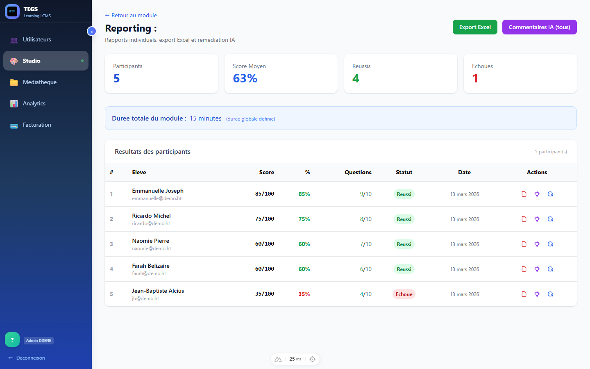

### Endpoints paiement

| Route | Description |
|-------|-------------|
| `POST /payment/initiate` | Initier MonCash/Natcash |
| `POST /payment/webhook/moncash` | Callback MonCash |
| `POST /payment/webhook/natcash` | Callback Natcash |
| `GET /payment/verify/:tid` | Verifier paiement |
| `POST /payment/manual-confirm` | Confirmation manuelle |
| `GET /payment/agent/search-participant` | Recherche participant |
| `POST /payment/agent/collect` | Encaisser cash (4 checks) |
| `GET /payment/agent/my-collections` | Journal de caisse |
| `GET /payment/agent/wallet` | Portefeuille + quota |
| `GET /payment/agent/deposit-slip` | Bordereau PDF |
| `POST /payment/agent/accept-contract` | Signer contrat |
| `GET /payment/agent/contract-pdf` | Contrat PDF |
| `PUT /payment/agent/update-settings/:id` | Config caution/limite |
| `POST /payment/agent/settle-debt/:id` | Versement → libere quota |
| `PUT /payment/agent/set-commission/:id` | Modifier taux |
| `PUT /payment/agent/verify/:id` | Activer agent |
| `GET /payment/agent/ledger/:id` | Historique caution |
| `GET /payment/agent/list` | Liste agents + quotas |

---

## 3.3. Terminal Mobile (TEGS-Arena App)

### Architecture Capacitor

```
capacitor.config.ts
  appId: com.tegs.arena
  appName: TEGS Arena
  webDir: .output/public
  Plugins: PushNotifications, SplashScreen, StatusBar
```

### 10 plugins natifs

| Plugin | Usage |
|--------|-------|
| `@capacitor/core` | Bridge natif |
| `@capacitor/app` | Interception bouton retour (lockdown) |
| `@capacitor/camera` | Photo proctoring / selfie |
| `@capacitor/push-notifications` | FCM (debut round, qualification) |
| `@capacitor/haptics` | Vibration (scan OK, alerte fraude) |
| `@capacitor/status-bar` | Dark mode, couleur #0f172a |
| `@capacitor/splash-screen` | Ecran demarrage anime |
| `@capacitor/browser` | Ouvrir liens paiement |
| `@capacitor/android` | Build APK |
| `html5-qrcode` | Scanner QR continu (superviseur) |

### 3 modes adaptatifs

**Mode Candidat** (`/mobile/warroom/[id]`):

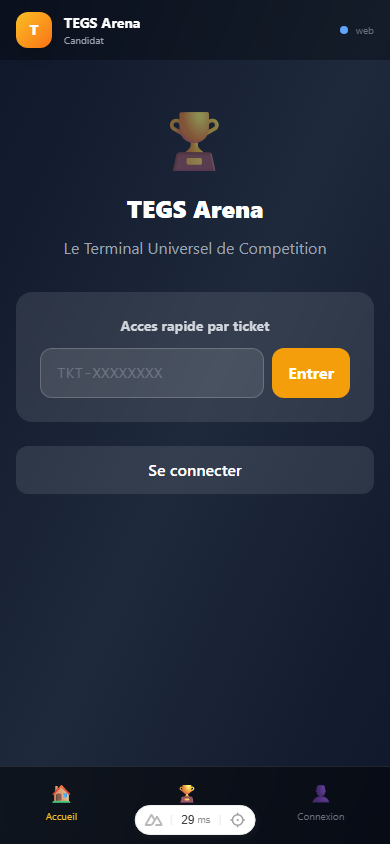

```
Lobby (attente) → Countdown (10s) → Lockdown (fullscreen) → Results
- Fullscreen force
- Bouton retour bloque
- Camera surveillance
- Vibration alerte
```

**Mode Superviseur** (`/mobile/supervisor`):

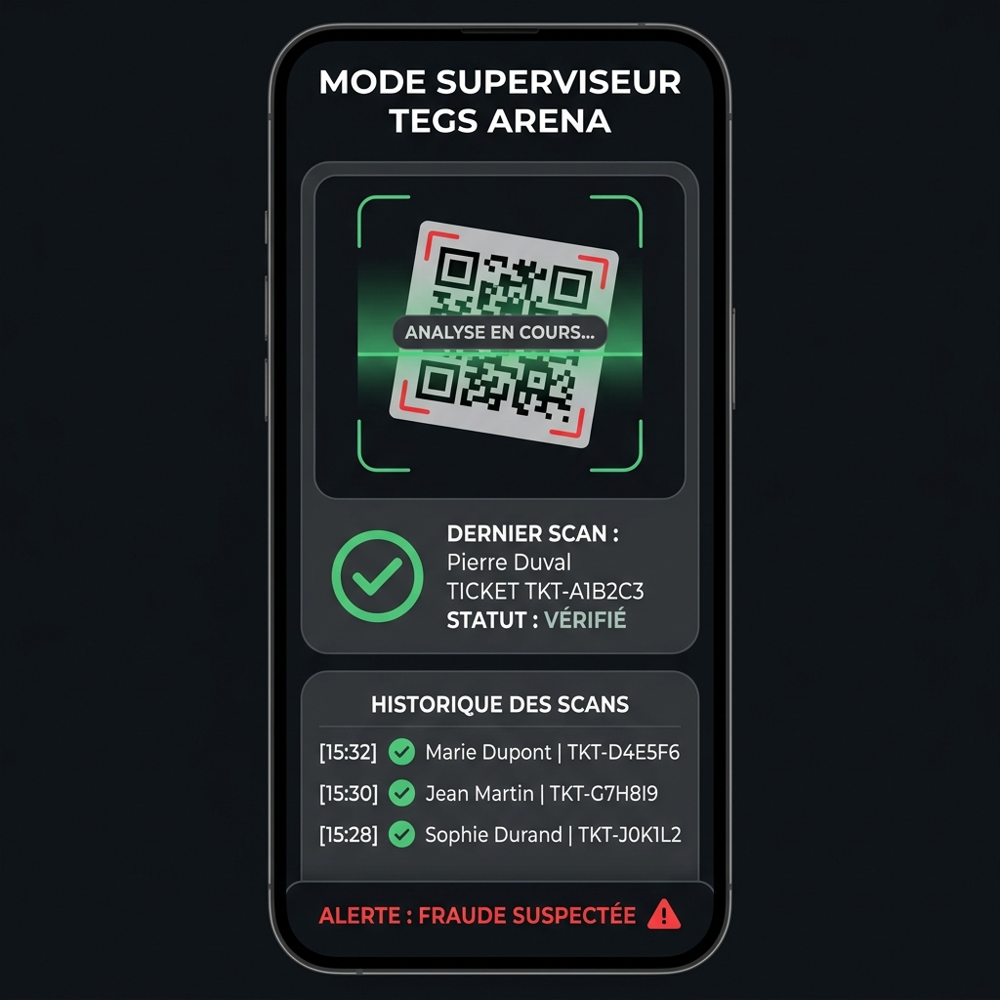

```
- Scanner QR continu (html5-qrcode)
- Verification badge → vibration OK/erreur
- Historique scans
- Alertes fraude temps reel
```

**Mode Spectateur** (`/mobile` → `/live-tournament/[token]`):

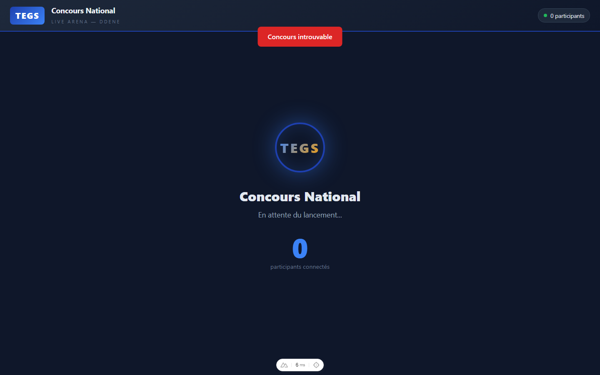

```
- Liste tournois live
- Arena TV mobile
- Vote public
```

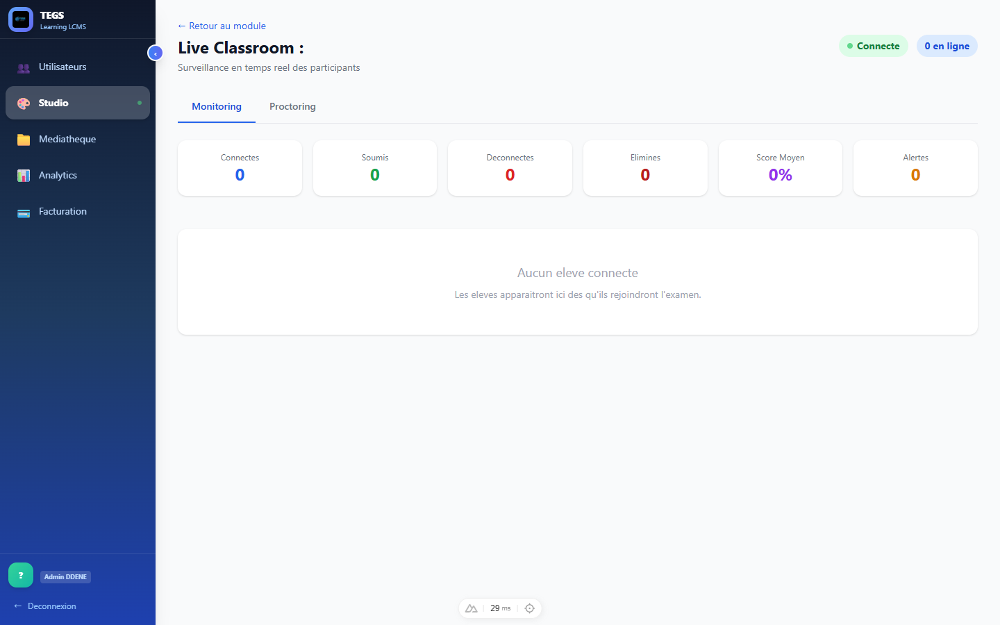

### Push Notifications (FCM)

| Event | Template |
|-------|----------|
| Round demarre | "Le round X commence ! Preparez votre camera !" |
| Qualifie | "Felicitations ! Vous etes qualifie(e) au rang X" |
| Elimine | "Fin de parcours au round X. Merci !" |
| Tournoi termine | "Decouvrez le podium et les resultats !" |
| Winner | "Champion ! Prime: X HTG" |
| Quota faible | "Attention, quota < 10%. Rechargez." |
| Settlement | "Versement valide. Quota reinitialise." |

---

## 3.4. Module Sponsoring

### Apercu de la gestion des sponsors

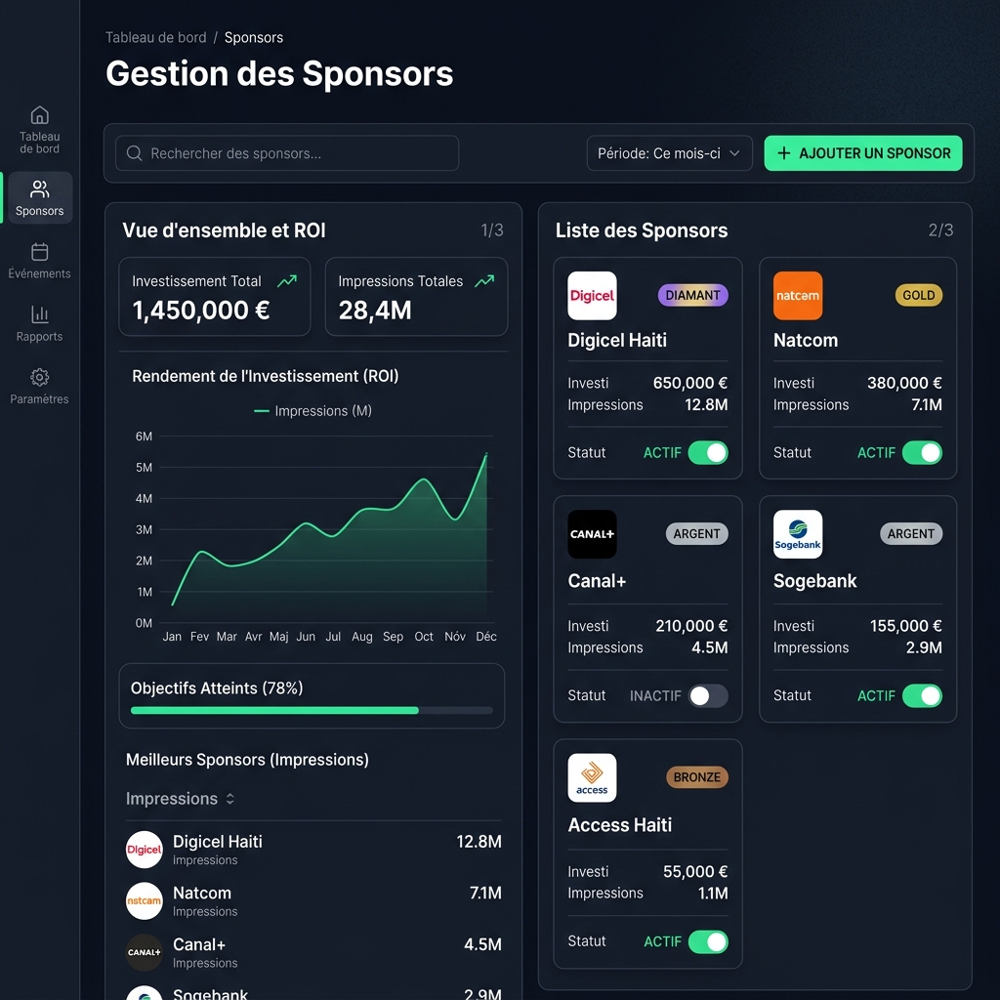

### Types de sponsors

| Tier | Visibilite |
|------|-----------|
| **Diamond** | Ticket + Certificat + Arena + Mobile + Ticker |
| **Gold** | Ticket + Certificat + Arena + Ticker |
| **Silver** | Ticket + Arena |
| **Bronze** | Ticket |

### Parrainage de masse (SponsorshipPack)

```
Admin cree un pack:
  Sponsor: Mairie Fort-Liberte
  Places: 200
  Montant: 100 000 HTG
  → Code genere: BOURSE-A1B2C3D4

Eleve s'inscrit:
  Saisit BOURSE-A1B2C3D4
  → Validation temps reel
  → Frais: 0 HTG
  → Badge: "Boursier de Mairie Fort-Liberte"
```

### Analytics ROI

| Metrique | Description |
|----------|-------------|
| Impressions | Compteur auto-incremente a chaque vue publique |
| Cost-per-impression | amountInvested / impressions |
| Participants exposes | Nombre total de candidats du tournoi |

### Endpoints sponsoring

| Route | Description |
|-------|-------------|
| `GET /sponsors/public/:tid` | Sponsors publics (+ impressions++) |
| `POST /sponsors/:tid` | Ajouter sponsor |
| `GET /sponsors/:tid` | Lister (admin) |
| `PUT /sponsors/edit/:sid` | Modifier |
| `DELETE /sponsors/edit/:sid` | Supprimer |
| `GET /sponsors/analytics/:tid` | ROI social |
| `POST /sponsorship/:tid` | Creer pack bourse |
| `GET /sponsorship/:tid` | Lister packs |
| `POST /sponsorship/validate-code` | Valider code |
| `POST /sponsorship/redeem` | Utiliser code |

---

## 3.5. Broadcasting & Engagement

### Apercu Arena TV Live


### Live Arena TV

**Page standard** (`/live-tournament/[token]`):
- TournamentTree avec bracket live
- Breaking news ticker
- Overlay promotion (qualifies/elimines)
- Podium reveal anime

**Mode Broadcast OBS** (`/live-tournament/[token]/broadcast`):
```
Resolution: 1920 × 1080 (Full HD)
FPS: 60 (will-change: transform, GPU acceleration)
Elements:
  - Plaque commentateur (via ?commentator=Nom)
  - Sponsor ticker deffilant (30s infinite)
  - Breaking news overlay
  - Podium reveal avec animations slide-up
  - Overlay "Coup de Coeur du Public"
  - Coeur anime a chaque vote

Raccourcis clavier:
  I = Guide OBS (config Browser Source, cles stream)
  P = Toggle podium
```

**Configuration OBS Studio:**
```
1. Source > Navigateur (Browser)
2. URL: https://domain.com/live-tournament/TOKEN/broadcast?commentator=Nom
3. Resolution: 1920 × 1080
4. FPS: 60
5. Parametres > Diffusion:
   - Facebook Live: cle depuis facebook.com/live/producer
   - YouTube Live: cle depuis studio.youtube.com > Go Live
```

### Fan Vote

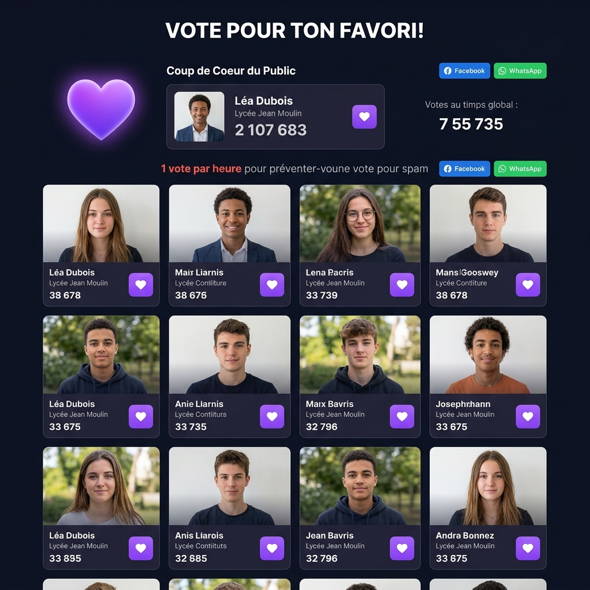

```
Page: /tournament/[token]/vote (publique, pas d'inscription)
Rate Limit: 1 vote par IP par heure
Socket: vote_received → coeur anime sur broadcast
Partage: Facebook + WhatsApp (message pre-rempli)

Double podium:
  - Major de Promotion (score academique)
  - Coup de Coeur du Public (votes)
```

### Endpoints vote

| Route | Description |
|-------|-------------|
| `POST /votes/:tid/:pid` | Voter (rate limit 1/h/IP) |
| `GET /votes/:tid/rankings` | Classement popularite |
| `GET /votes/:tid/popular` | Coup de Coeur #1 |

---

# IV. Robustesse et Performance

## 4.1. Waiting Room

### Apercu de la salle d'attente

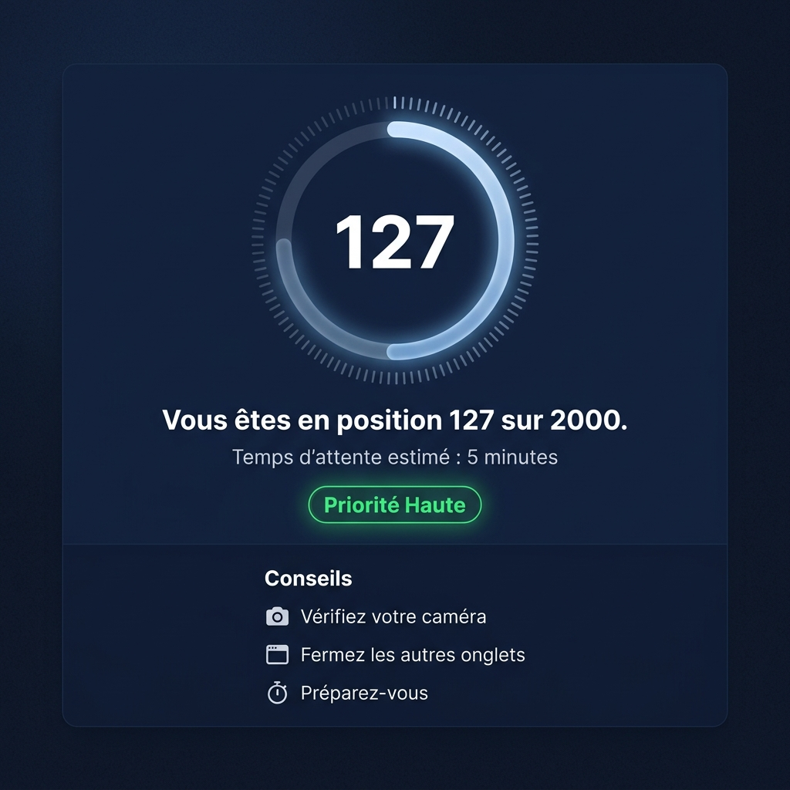

### TrafficController (singleton Node.js)

```
Parametres:
  maxConcurrent: 2000 (seuil avant activation)
  batchSize: 50 (personnes liberees par cycle)
  intervalSeconds: 30 (frequence de liberation)

Priorite:
  HIGH = candidat avec competitionToken valide (passe devant)
  NORMAL = spectateur / visiteur

Admin controls:
  POST /queue/force { enabled: true } → active le sas globalement
  POST /queue/force { tournament_id, enabled: true } → par tournoi
  PUT /queue/configure { maxConcurrent: 5000 } → ajuster en live
```

### Page sas (`/tournament/waiting-room`)

```
- Barre circulaire avec position en file
- Temps estime (batches × intervalle)
- Badge "Priorite haute" si competitionToken
- Tips (camera, micro, fermer onglets)
- Poll toutes les 5 secondes
- Redirection automatique au "green light"
```

## 4.2. Proctoring


| Niveau | Mecanismes |
|--------|-----------|
| **Light** | Detection perte de focus (blur), anti-copie |
| **Strict** | Fullscreen force, max blur count, auto-submit on exceed |
| **Snapshot** | Capture webcam periodique (10-120s) |
| **Video** | WebRTC stream vers le professeur |

**Donnees enregistrees (ProctoringEvidence):**
- snapshot, audio_alert, fullscreen_exit, blur
- imageData (base64), trigger, audioLevel, timestamp
- TTL 90 jours (auto-suppression)

---

# V. Specifications des Donnees & API

## 5.1. Modeles de donnees (17 collections MongoDB)

### Diagramme de relations

```
Tenant ──1:N──> User
  │                │
  │                ├── role: student → Participant
  │                ├── role: teacher → Module (created_by)
  │                ├── role: authorized_agent → Transaction (collectedBy)
  │                └── role: admin_ddene
  │
  ├──1:N──> Module ──1:N──> Section ──1:N──> Screen ──1:N──> ContentBlock
  │            │
  │            ├──> QuizResult (module_id, user_id)
  │            ├──> LiveSession (module_id)
  │            ├──> LaunchSession (module_id, cmi5)
  │            └──> ProctoringEvidence (module_id)
  │
  ├──1:N──> Tournament
  │            │
  │            ├──1:N──> Participant ──> Transaction
  │            ├──1:N──> Sponsor
  │            ├──1:N──> SponsorshipPack
  │            └──1:N──> Vote
  │
  ├──1:N──> Statement (xAPI)
  │
  └──1:N──> GuaranteeLog (agent caution)

User ──1:N──> DeviceToken (FCM)
```

### Apercu de l'editeur de modules (LCMS)

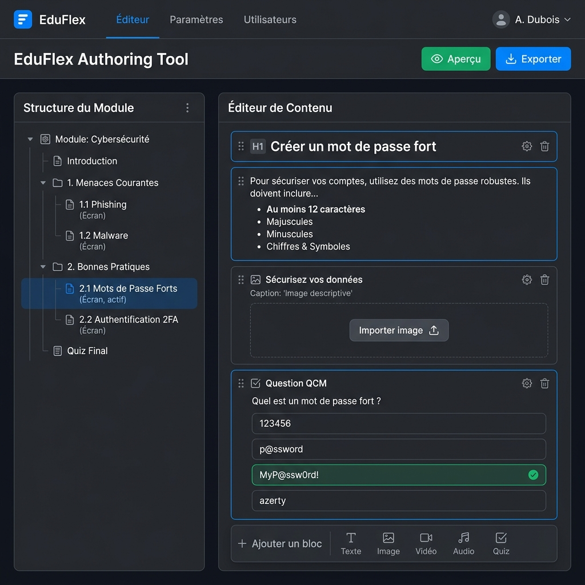

### Detail des champs par modele

**User** (7 roles possibles):
```
email, password (bcrypt), firstName, lastName
role: superadmin | admin_ddene | teacher | student | authorized_agent
tenant_id, isActive, district, className
Agent fields: organizationName, isAgentVerified, commissionRate (0-50%),
  guaranteeBalance, usedQuota, isBlocked, maxPaymentLimit,
  currentPaymentCount, contractAcceptedAt, contractVersion
```

**Tournament**:
```
title, description, coverImage
status: draft | registration | active | completed | cancelled
registrationFee, currency (HTG/USD), maxParticipants
registrationOpen, registrationClose (dates)
rounds: [{ order, label, module_id, promoteTopX, status, startTime, endTime }]
prizes: [{ rank, label, amount, currency }]
currentRound, shareToken, tenant_id, created_by
```

**Participant**:
```
tournament_id, user_id, tenant_id
firstName, lastName, email, phone, establishment, district
competitionToken (TKT-XXX auto-genere)
status: registered | qualified | eliminated | winner | disqualified
roundResults: [{ round, module_id, quizResult_id, score, maxScore, percentage, duration, status }]
finalRank, totalScore, paid, sponsorCode, sponsorName, transaction_id
```

**Transaction**:
```
participant_id, tournament_id, tenant_id
amount, currency
provider: moncash | natcash | stripe | manual | agent_cash
providerRef, providerResponse
collectedBy (agent ObjectId), agentName, organizationName, receiptNumber
commissionRate, commissionAmount, netAmount
status: pending | completed | failed | refunded
completedAt
```

**Sponsor**:
```
tournament_id, tenant_id
name, logoUrl, website, slogan, contactEmail, contactPhone
type: commercial | public | individual | school
tier: diamond | gold | silver | bronze
amountInvested, currency, inKindDescription
showOnTicket, showOnCertificate, showOnArena, showOnMobile
impressions (auto-incremented), isActive
```

**SponsorshipPack**:
```
tournament_id, sponsor_id, tenant_id
sponsorName, sponsorType: mairie | entreprise | ong | ecole | particulier | gouvernement
code: BOURSE-XXXXXXXX (auto-genere)
maxUses, usedCount, amountPaid, currency, pricePerCandidate
district, establishment (contraintes optionnelles)
isActive, expiresAt
```

**Vote**:
```
tournament_id, participant_id, voterIp, voterSession
Index: (tournament_id, participant_id, voterIp, createdAt) pour rate limiting
```

**DeviceToken**:
```
token (FCM), user_id, participant_id, tenant_id
platform: android | ios | web
active: Boolean
```

**GuaranteeLog**:
```
agent_id, admin_id
type: deposit | withdrawal | reset | adjustment
amount, balanceBefore, balanceAfter, note, tenant_id
```

## 5.2. Documentation des endpoints API (120+)

### Routes publiques (sans authentification)

| # | Methode | Route | Description |
|---|---------|-------|-------------|
| 1 | GET | `/api/health` | Health check |
| 2 | GET | `/api/tournaments/public/:shareToken` | Infos tournoi publiques |
| 3 | POST | `/api/tournaments/public/:shareToken/register` | Inscription + QR |
| 4 | GET | `/api/tournaments/verify-token/:token` | Verifier badge |
| 5 | GET | `/api/share/public/:shareToken` | Page examen HTML |
| 6 | GET | `/api/share/public/:shareToken/json` | Questions JSON |
| 7 | POST | `/api/share/public/:shareToken/session` | Demarrer session exam |
| 8 | POST | `/api/share/public/:shareToken/session/tick` | Timer tick |
| 9 | POST | `/api/share/public/:shareToken/session/close` | Fermer session |
| 10 | GET | `/api/live-arena/:shareToken` | Live Arena TV HTML |
| 11 | GET | `/api/sponsors/public/:tournamentId` | Sponsors (impressions++) |
| 12 | POST | `/api/sponsorship/validate-code` | Valider code bourse |
| 13 | POST | `/api/sponsorship/redeem` | Utiliser code bourse |
| 14 | POST | `/api/votes/:tid/:pid` | Voter (1/h/IP) |
| 15 | GET | `/api/votes/:tid/rankings` | Classement votes |
| 16 | GET | `/api/votes/:tid/popular` | Coup de Coeur |
| 17 | GET | `/api/queue/status` | Position file attente |
| 18 | POST | `/api/queue/release` | Liberer place |
| 19 | POST | `/api/payment/initiate` | Initier paiement |
| 20 | POST | `/api/payment/webhook/moncash` | Callback MonCash |
| 21 | POST | `/api/payment/webhook/natcash` | Callback Natcash |
| 22 | GET | `/api/payment/verify/:tid` | Verifier paiement |
| 23 | POST | `/api/payment/manual-confirm` | Confirm manuelle |
| 24 | POST | `/api/notifications/register-device` | Enregistrer FCM |
| 25 | GET | `/api/tenants/public` | Liste ecoles publiques |
| 26 | POST | `/api/auth/register` | Inscription |
| 27 | POST | `/api/auth/login` | Connexion |

### Routes authentifiees (JWT required)

| # | Methode | Route | Role | Description |
|---|---------|-------|------|-------------|
| 28 | GET | `/api/auth/me` | All | Profil connecte |
| 29-43 | * | `/api/modules/*` | Teacher+ | CRUD modules, structure, screens, share, AI |
| 44-58 | * | `/api/tournaments/*` | Admin+ | CRUD tournois, rounds, advance, bracket, podium, certificat |
| 59-76 | * | `/api/payment/agent/*` | Agent/Admin | POS: collect, wallet, journal, bordereau, contrat, settle |
| 77-82 | * | `/api/sponsors/*` | Admin+ | CRUD sponsors, analytics ROI |
| 83-87 | * | `/api/sponsorship/*` | Admin+ | Packs parrainage |
| 88-93 | * | `/api/queue/*` | Admin | Stats, force sas, configure |
| 94-98 | * | `/api/analytics/*` | Admin+ | KPIs, agent-collections, tournament-kpis |
| 99-105 | * | `/api/reporting/*` | Teacher+ | PDF, Excel, AI commentary, remediation |
| 106-110 | * | `/api/subscription/*` | Admin | Plans, seats, usage |
| 111-114 | * | `/api/sync/*` | Teacher+ | Batch xAPI, SQLite import |
| 115-117 | * | `/api/notifications/*` | Admin | Send push tournament/user |
| 118-122 | * | `/api/users/*` | Admin+ | CRUD utilisateurs |
| 123-127 | * | `/api/tenants/*` | SuperAdmin | CRUD ecoles |
| 128-131 | * | `/api/upload/*` | Teacher+ | Images GCS |
| 132-133 | * | `/api/xapi/*` | Teacher+ | Statements xAPI |
| 134-137 | * | `/api/qrcode/*` | Teacher+ | QR modules, badges |
| 138-142 | * | `/api/cmi5/*` | Teacher+ | Manifest, launch, player |

### Socket.io (4 namespaces, 30+ events)

| Namespace | Direction | Event | Description |
|-----------|-----------|-------|-------------|
| `/prof` | Client→ | join_room | Rejoindre salle module |
| `/prof` | Client→ | contest_start/pause/resume/skip/stop | Controles competition |
| `/prof` | Client→ | proctor_request_snapshot | Demander capture webcam |
| `/prof` | Server→ | student_roster, student_joined | Liste etudiants |
| `/prof` | Server→ | contest_rankings, contest_reveal | Classement, correction |
| `/student` | Client→ | join_exam, answer_submitted | Participation |
| `/student` | Client→ | blur_detected, fullscreen_exit | Alertes proctoring |
| `/student` | Server→ | NEXT_QUESTION_TRIGGER | Question suivante (atomique) |
| `/spectator` | Client→ | join_arena | Rejoindre en spectateur |
| `/spectator` | Server→ | contest_state, rankings, breaking_news | Diffusion live |
| `/tournament` | Client→ | join_tournament | Spectateur via shareToken |
| `/tournament` | Client→ | join_admin | Admin via JWT |
| `/tournament` | Client→ | admin_start_round | Demarrer round (broadcast) |
| `/tournament` | Client→ | admin_advance | Promotion (broadcast) |
| `/tournament` | Server→ | tournament_state, tournament_bracket | Etat complet |
| `/tournament` | Server→ | round_started, round_advanced | Lifecycle |
| `/tournament` | Server→ | tournament_finished, breaking_news | Fin + flash |
| `/tournament` | Server→ | vote_received | Vote temps reel |

## 5.3. Flux de paiements et regularisation


### Flow inscription payante

```
1. Candidat ouvre /tournament/[shareToken]
2. Remplit formulaire (nom, email, etablissement, code bourse optionnel)
3. POST /tournaments/public/:shareToken/register
   → Si code bourse valide: paid=true, sponsorName="Mairie..."
   → Si tournoi gratuit: paid=true
   → Sinon: paid=false, requiresPayment=true
4a. Paiement Mobile:
    POST /payment/initiate { participant_id, provider: "moncash" }
    → Redirect vers MonCash → Webhook → paid=true → QR
4b. Paiement Cash (Agent):
    Agent cherche participant → POST /payment/agent/collect
    → 4 checks → Transaction agent_cash → paid=true → QR + recu
5. competitionToken actif → peut acceder au concours
```

### Flow regularisation agent

```
1. Agent encaisse N inscriptions
   → usedQuota augmente a chaque collect
   → Si usedQuota >= guaranteeBalance → BLOQUE
2. Agent genere son bordereau PDF (GET /agent/deposit-slip)
3. Agent se rend au bureau DDENE avec cash + bordereau
4. Comptable scanne le QR du bordereau
5. Admin POST /agent/settle-debt/:id { amountSettled }
   → usedQuota diminue
   → Si marge suffisante → AUTO-DEBLOQUE
   → Push FCM a l'agent
6. Agent peut reprendre les encaissements
```

---

# VI. Guide de Deploiement et Maintenance

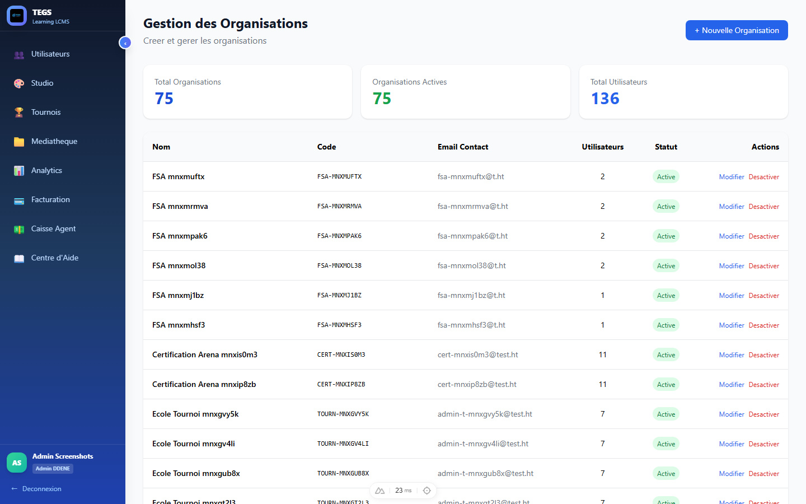

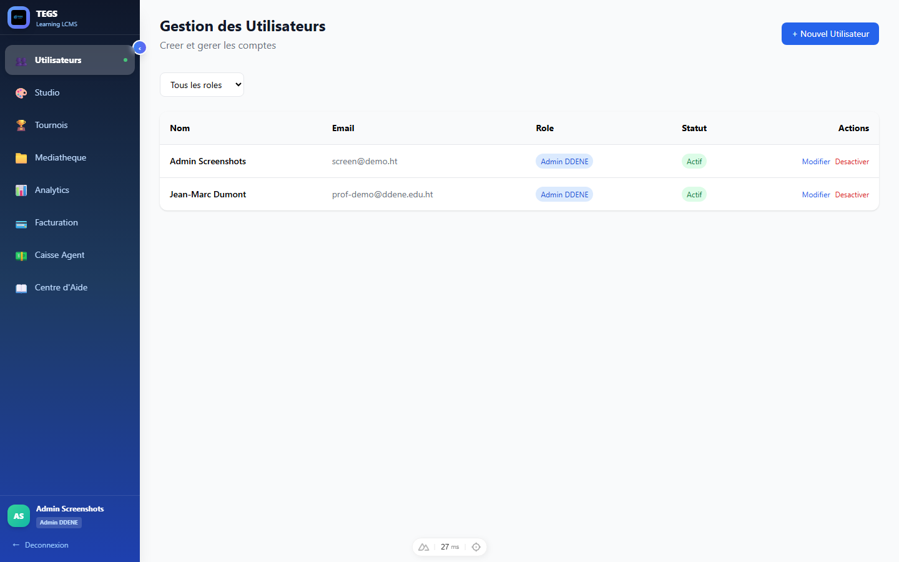

## 6.1. Procedures de mise a jour (CI/CD)

### Cloud Build (cloudbuild.yaml)

```yaml
Steps:
  1. build-backend   → Docker build + tag (gcr.io/PROJECT/tegs-backend:SHA)
  2. push-backend    → Push to Container Registry
  3. deploy-backend  → Cloud Run (1Gi, 2CPU, 7 secrets, NODE_ENV=production)
  4. build-frontend  → npm ci + nuxi generate (NUXT_PUBLIC_API_BASE dynamique)
  5. deploy-frontend → Firebase deploy --only hosting
```

### Deploiement manuel

```bash
bash deploy/deploy-manual.sh
# 1. Build & push Docker → Cloud Run
# 2. Build Nuxt → .output/public
# 3. Firebase deploy
```

### Setup initial (une seule fois)

```bash
bash deploy/gcloud-setup.sh
# Active APIs, cree 7 secrets, configure IAM
# Puis remplir les secrets:
echo -n 'mongodb+srv://...' | gcloud secrets versions add tegs-mongo-uri --data-file=-
echo -n 'JWT_SECRET_VALUE' | gcloud secrets versions add tegs-jwt-secret --data-file=-
echo -n 'MONCASH_ID' | gcloud secrets versions add tegs-moncash-client-id --data-file=-
# etc.
```

## 6.2. Monitoring

### Apercu du dashboard Analytics

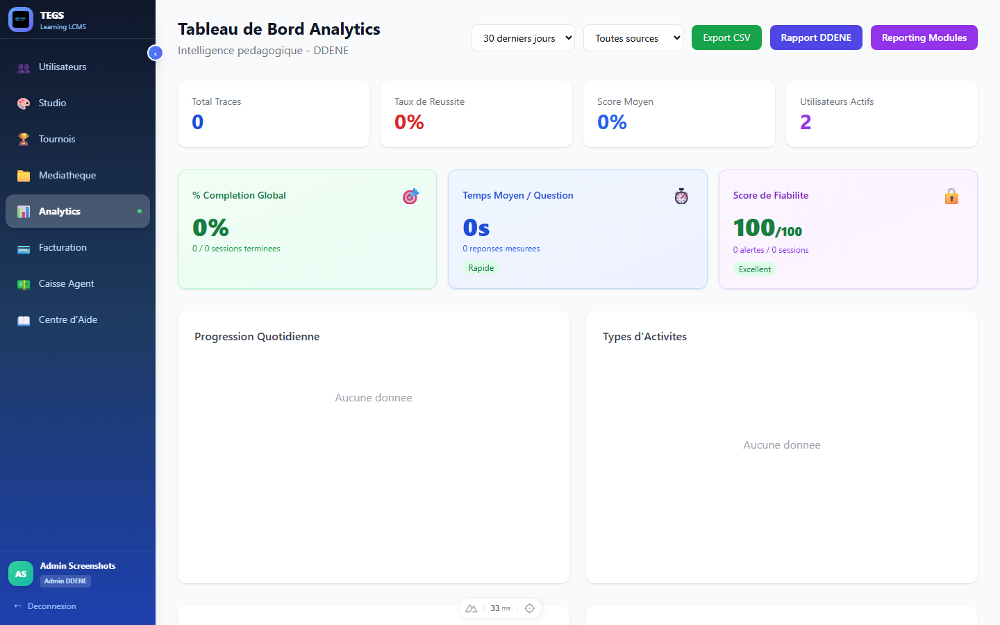

| Outil | Usage |
|-------|-------|
| Cloud Run logs | CLOUD_LOGGING_ONLY dans cloudbuild |
| `/api/health` | Health check (30s interval) |
| `/api/queue/stats` | File d'attente temps reel |
| `/api/analytics/agent-collections` | Finances agents |
| `/api/analytics/tournament-kpis/:id` | KPIs tournoi |

## 6.3. Documents PDF generes

### Apercu du Podium Final

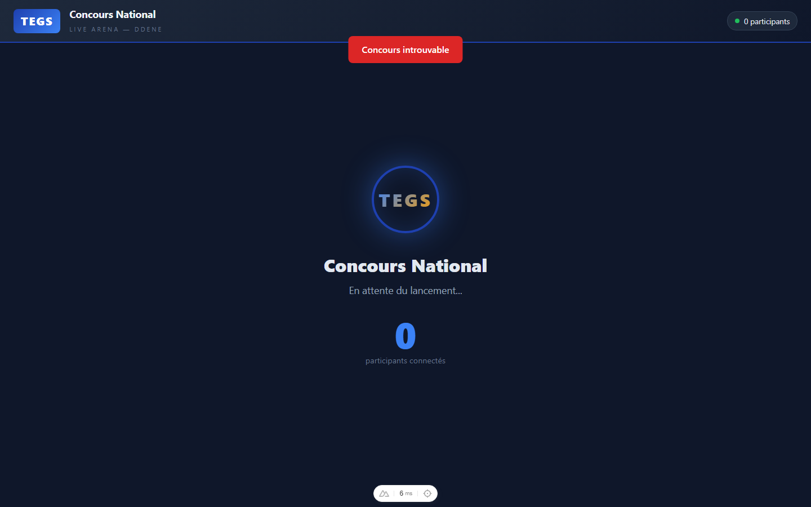

| Document | Route | Contenu |
|----------|-------|---------|
| Certificat Champion | `GET /tournaments/:id/certificate/:pid` | Rang, prime, sponsors, date, token verification |
| Contrat Agent | `GET /payment/agent/contract-pdf` | 6 articles, caution, commission, signatures |
| Bordereau Versement | `GET /payment/agent/deposit-slip` | Transactions, commission, net, QR scan, signatures |

---

# VII. Annexes

## 7.1. Variables d'environnement

```env
# Core
PORT=3000
MONGODB_URI=mongodb+srv://...
JWT_SECRET=...
JWT_EXPIRES_IN=24h
NODE_ENV=production
FRONTEND_URL=https://luminous-mesh-459718-p4.web.app

# GCP Storage
GCS_ENABLED=true
GCS_SERVICE_URL=https://dp-storage-service-746425674533.us-central1.run.app
GCS_JWT_SECRET=...

# MonCash (Digicel Haiti)
MONCASH_CLIENT_ID=...
MONCASH_CLIENT_SECRET=...
MONCASH_MODE=sandbox|live

# Natcash (Natcom Haiti)
NATCASH_MERCHANT_ID=...
NATCASH_API_KEY=...
NATCASH_MODE=sandbox|live

# Firebase Cloud Messaging
FCM_PROJECT_ID=luminous-mesh-459718-p4
GOOGLE_APPLICATION_CREDENTIALS=path/to/service-account.json
```

## 7.2. Resultats de certification


### Test Tournaments (110/110 PASS)
```
CRUD, inscription publique, QR, departage temps, promotion,
bracket, podium, paiement manual, notifications, suppression
```

### Test Certification (133/133 PASS)
```
5 domaines: Brain (qualification), Wallet (paiement),
Terminal (mobile), Arena (socket), Infrastructure (GCP)
```

### Test Full-Stack Arena (90/90 PASS)
```
6 domaines: Agents (quota+block+settle), Sponsoring (bourse+code),
Mobile (6 plugins), Social (vote+rate-limit), Podium (double cert),
Infrastructure (secrets+CORS+deploy)
```

## 7.3. Glossaire technique

| Terme | Definition |
|-------|-----------|
| **promoteTopX** | Nombre de candidats qualifies pour le round suivant |
| **section_index** | Index du chapitre dans le module (null = tout le module) |
| **competitionToken** | Code unique TKT-XXX genere a l'inscription |
| **shareToken** | Identifiant public d'un tournoi pour les liens partageables |
| **guaranteeBalance** | Caution deposee par un agent (plafond de collecte) |
| **usedQuota** | Montant total collecte non encore reverse par l'agent |
| **netAmount** | Montant a reverser a la DDENE (total - commission) |
| **SponsorCode** | Code BOURSE-XXX permettant une inscription gratuite |
| **Waiting Room** | Sas virtuel limitant les connexions simultanees |
| **Clean Feed** | Flux video optimise pour capture OBS (60fps, 1080p) |
| **Coup de Coeur** | Prix de popularite base sur les votes du public |
| **Settlement** | Versement de l'agent a la DDENE (libere le quota) |

---

**Document genere le 13 avril 2026**
**TEGS-Learning v2.0 — edromediaTech / DDENE Haiti**
